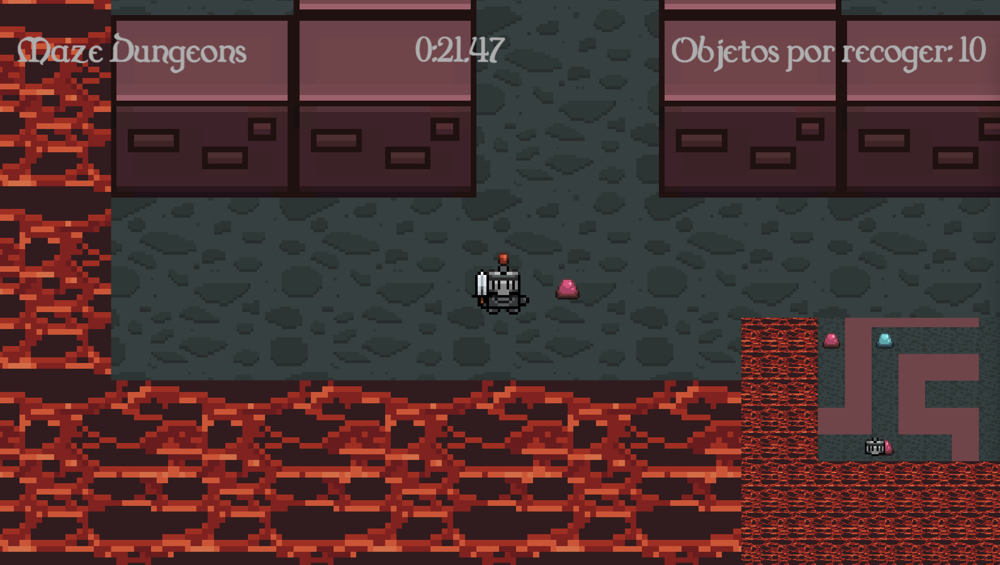

# Maze Dungeons 
#### Author: Gonzalo de las Heras

Maze dungeons is a small 2D game developed in Unity whose objective is to collect 10 beepers placed in a maze that is randomly generated (using Kruskal's algorithm) each time a game is started. 